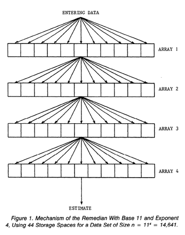

# Remedian
Remedian is a Rust implementation of [The Remedian](https://www.researchgate.net/publication/247974442_The_Remedian_A_Robust_Averaging_Method_for_Large_Data_Sets), a robust method to approximate the median of a large dataset, without needing to load the entire thing in memory.
This is desirable in cases where the dataset is so large that loading the whole thing simultaneously is intractable.

Basic usage:
```rs
// The default block is configured with a reasonable b and k for most applications
let mut remedian = RemedianBlock::default();

// Read data points from our data source, and fold them into the remedian
for data_point in some_data_stream {
		remedian.add_sample_point(data_point);
}

// Get our (approximate) answer
let median = remedian.median();
```

For more details, check out `examples/minimal.rs` or `examples/full.rs`

## The Remedian

The Remedian algorithm is quite simple in concept.
It stores `k` arrays of size `b`, (where `k` and `b` are hyperparameters).
Here, we see an example with 4 arrays of size 11:



As points are read in from the stream, each array is filled in turn:
1. The first 11 sample points fill the first array
2. The median is calculated for array 1, and this intermediate median is stored in the first cell of array 2
3. The next 11 sample points re-fill the first array
4. The median is again calculated for array 1, and this new intermediate median is stored in the second cell of array 2
5. This process continues, progressively filling each array, until the final array is completely full of data
6. Then, the median of the final array is calculated and returned

In this way, The Remedian can account for `b^k` sample points, while only using `b*k` space.

## Testing

A sample file of 2000 randomly generated numbers can be found in `test_data/2000_values.txt`.
The values are uniformly distributed from 1 to 1000, and are used in tests to ensure accuracy.
